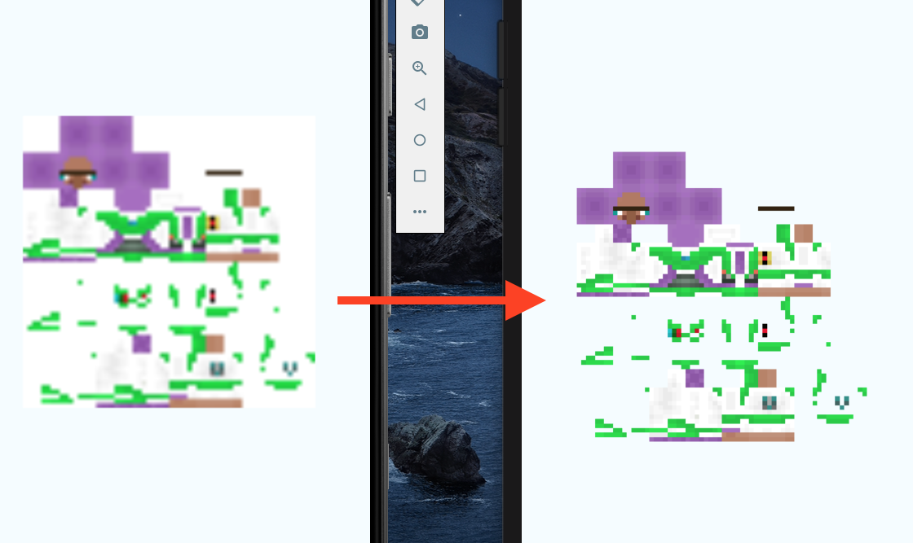

## A library to help you fix images magnification.(show image pixelated)

## Easy example:

</br>


## Usage
**You don't need to install this package in order to fix images.**
Add a postinstall script in your package.json and every time you will install dependencies the script will run fixing the problem.


1. add postinstall script (example below);
2. run `yarn install` or `npm i` if you use npm;
3. rebuild project in Xcode;
#

### Example package.json with postinstall script
```json
{
  "name": "ReactNativeApp",
  "version": "0.0.1",
  "private": true,
  "scripts": {
    "android": "react-native run-android",
    "ios": "react-native run-ios",
    "start": "react-native start",
    "postinstall": "npx react-native-fix-magnification"
  }
}
```

### Notes 
- Also if you have multiple postinstall commands you can combine them as following: 
```json
...
    "postinstall": "npx react-native-fix-magnification && npx react-native-fix-image"
 ...
}
```